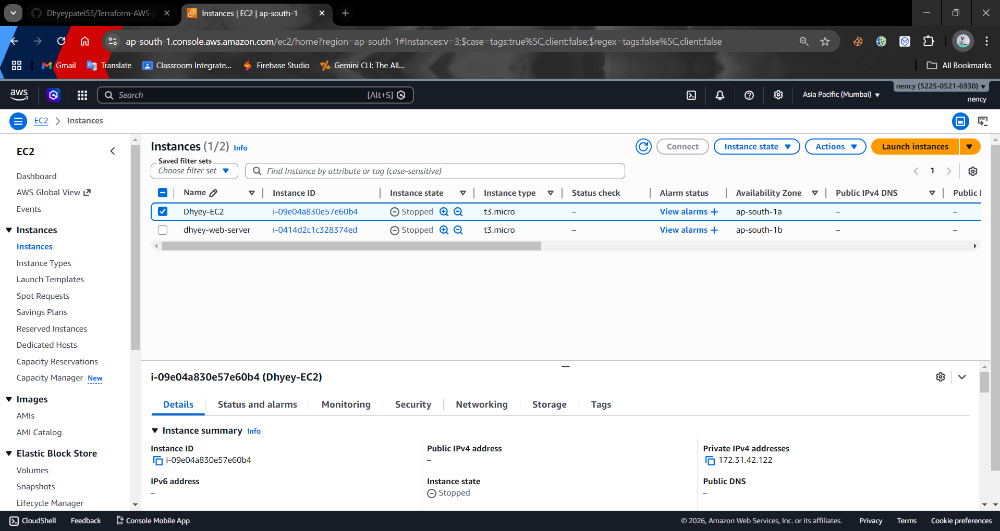
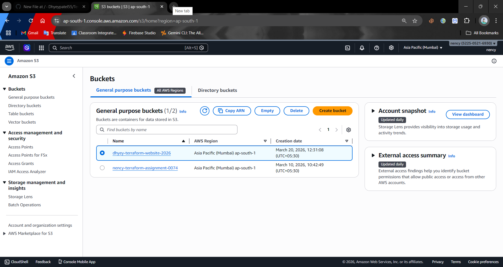
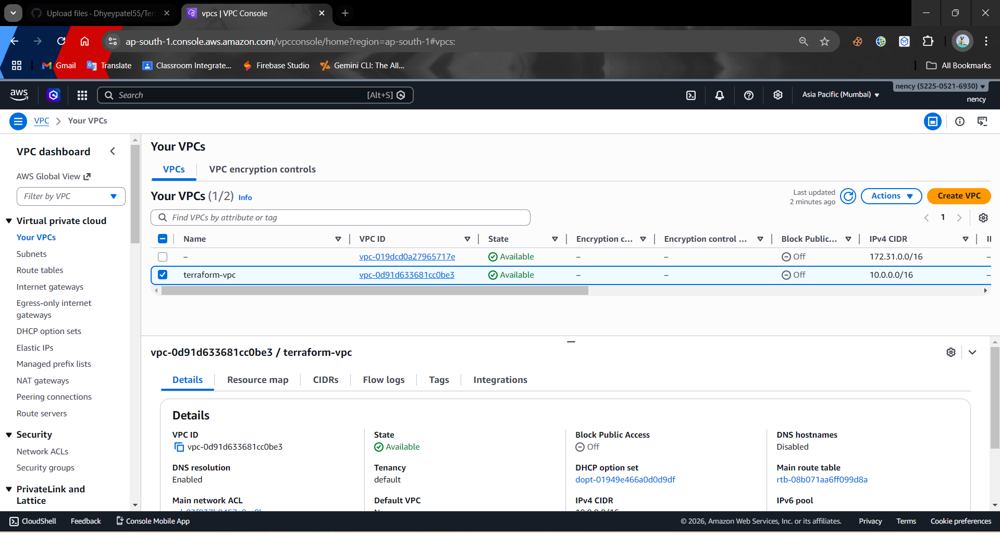

# AWS 3-Tier Architecture using Terraform 🚀

## 📌 Overview
This project demonstrates the deployment of a scalable 3-tier architecture on AWS using Terraform.

## 🏗️ Architecture
- Frontend: EC2 instance
- Backend: EC2 instance
- Database: RDS (MySQL)
- Networking: VPC, Subnets, Security Groups
- Load Balancer: Application Load Balancer

## ⚙️ Technologies Used
- AWS (EC2, RDS, VPC, IAM)
- Terraform
- Linux

## 🔥 Features
- Infrastructure as Code (IaC)
- Automated deployment using Terraform
- Scalable and secure architecture
- High availability using Load Balancer

## 🚀 How to Run

```bash
terraform init
terraform plan
terraform apply

## 📸 Output / Screenshots

### 💻 EC2 Instance Running


### ☁️ S3 Bucket


### 🌐 VPC Configuration

